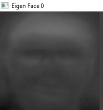

# MCSC202-PCA-
## About
MCSC 202 Mini-Project : Principal Component Analysis in Image Processing
## Instructions to Run the Project
* Run the command in Anaconda: ```python Face_Recognition.py```
## Project Demo
[Project Demo Video Link](https://www.dropbox.com/scl/fi/hn7s8mgskge20vtpadnum/PCA_Demo.mp4?rlkey=hbkkrzfbbtwjtek2d86j6opq5&st=2ud4r3qc&dl=0)
## Screenshots

*originalImage*

*eigenFace*

*PCA_Image*
